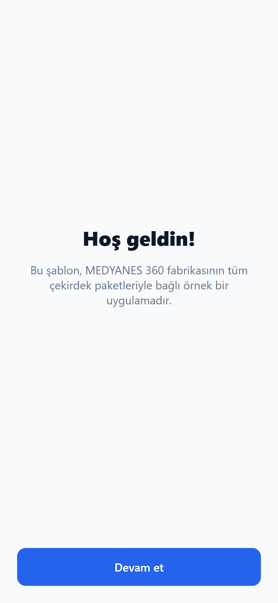
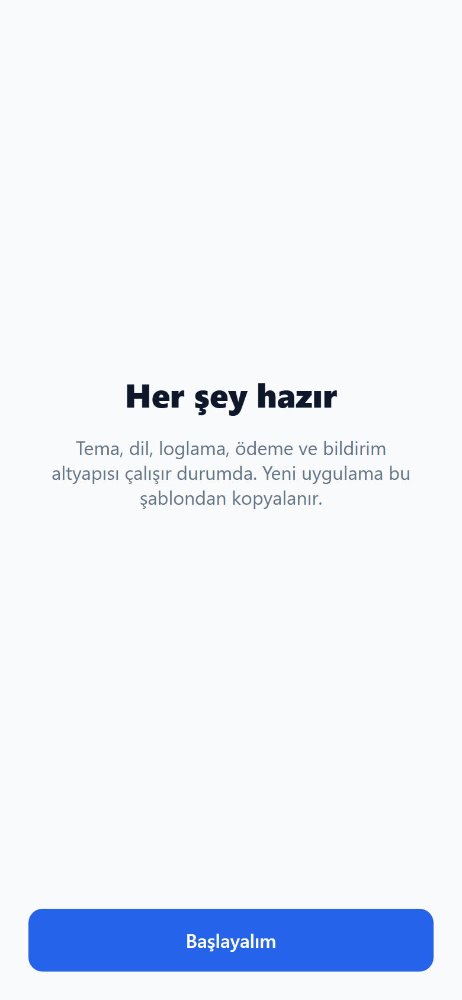
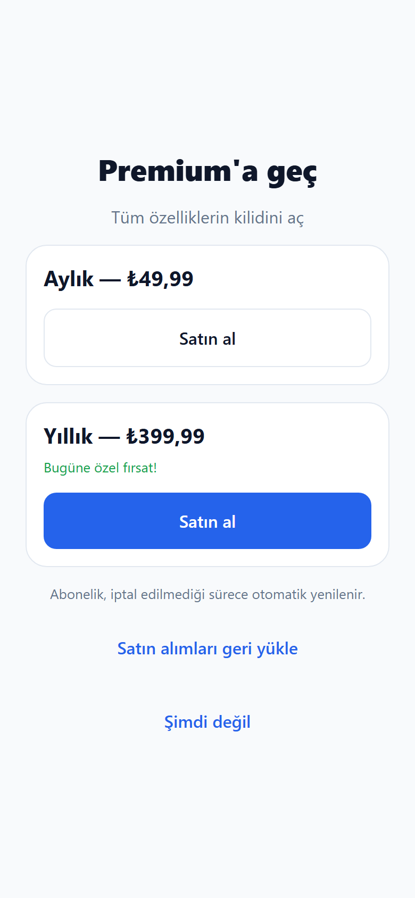
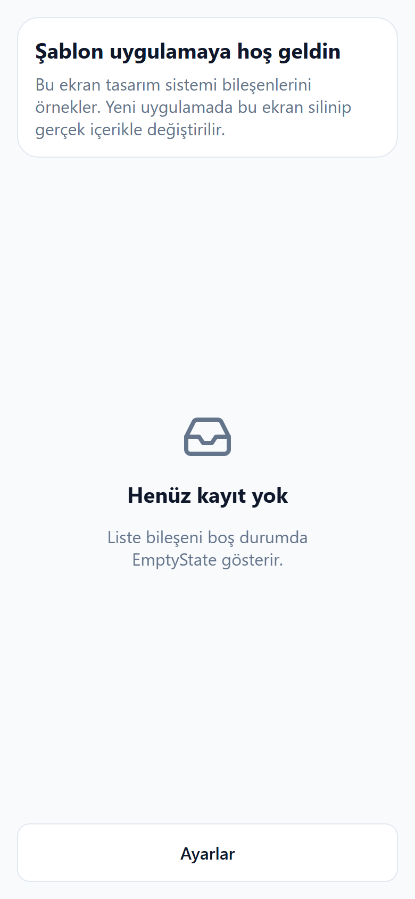
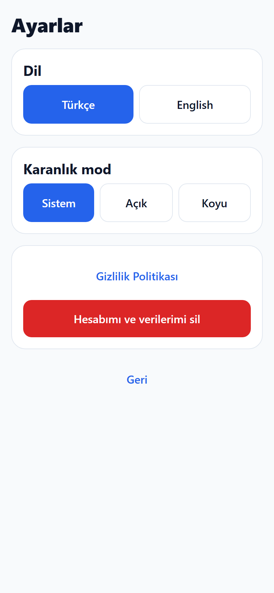
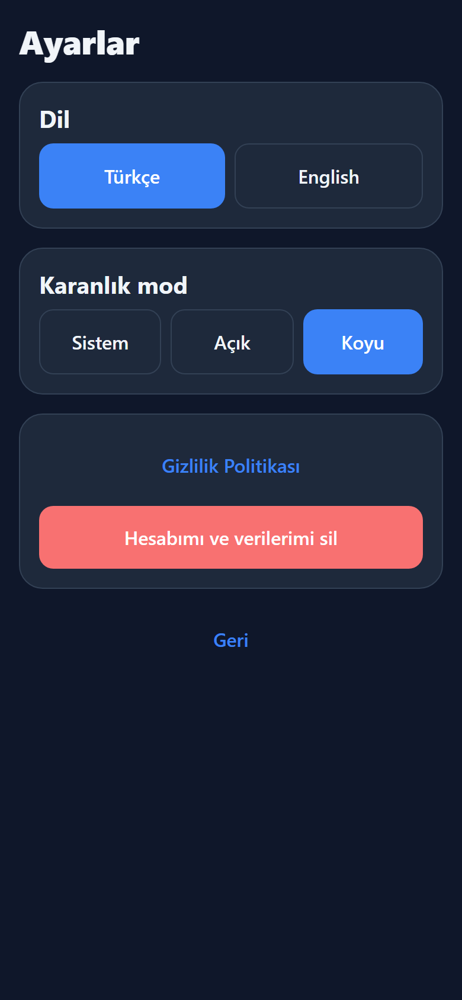

# Görsel Vitrin — Şablon Uygulama

> Telefonda gezmek yerine bu sayfadan ekranları inceleyebilirsin.
> Agent ekran değiştirdiğinde bu dosya ve görseller otomatik güncellenir.

**Son güncelleme:** 16.06.2026 11:54:04
**Commit:** `cc224f4`

## Nasıl yorum yaparsın?

1. Aşağıdaki görsellere bak.
2. Beğenmediğin yeri yaz: _"Paywall başlığı çok küçük"_ veya _"Ana sayfa renklerini değiştir"_.
3. Agent düzeltir ve bu vitrini yeniler.

---

## Karşılama — 1. adım

İlk açılışta kullanıcının gördüğü tanıtım ekranı.

## Karşılama — 2. adım

## Üyelik / Paywall

Premium teklif ekranı. Fiyatlar ve planlar burada.

## Ana sayfa

Onboarding sonrası ana ekran vitrini.

## Ayarlar

Dil, tema ve hesap işlemleri.

## Ayarlar — koyu tema seçili

